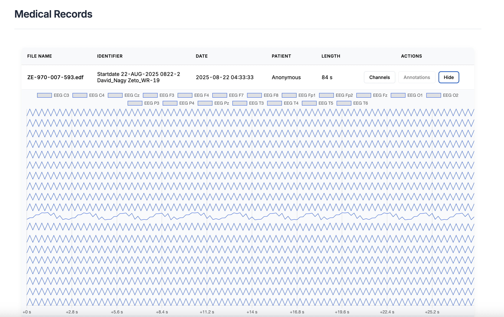

# EDF viewer

Demo project to parse and view EDF files.

"The European Data Format (EDF) is a simple and flexible format for exchange and storage of multichannel biological and physical signals."

### Backend
Provides a simple REST API to view EDF files from a predefined directory.
The files are parsed as per the [EDF specification](https://www.edfplus.info/).

Parsing limitations:

1. The basic EDF specifications are implemented, except for byte level validation
2. EDF+ specs are partly implemented
   1. Annotation parsing ✅
   2. Patient data parsing ✅
   3. Recording data parsing ✅
   4. Header field validations ❌ 
   5. Handling interrupted recording ❌

**Tech Stack**

- Java 25 - Latest LTS version for Java
- Spring Boot - Provides the Web interface, DI and testing capabilities
- Lombok - For convenience

### Frontend
Single-page Vue.js application, that present the backend provided data.

**Tech Stack**

- Vue.js
- Chart.js - Popular lib to display graphs

### Running the application
To run the application, execute `docker compose up`, it will build and start the application.

**Frontend** - `http://localhost`

**Backend** - `http://localhost:8080`

**API docs** - `http://localhost:8080/swagger-ui/index.html`

